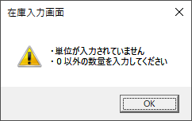
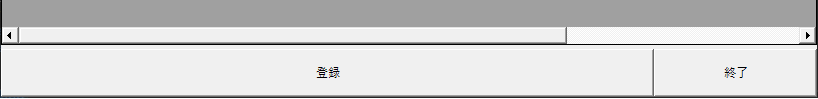
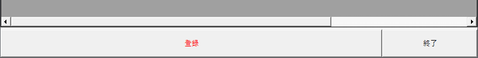
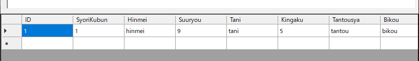
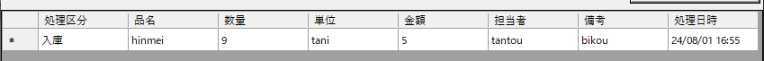
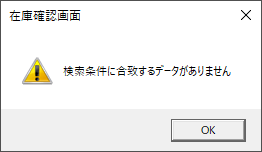
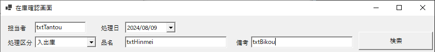
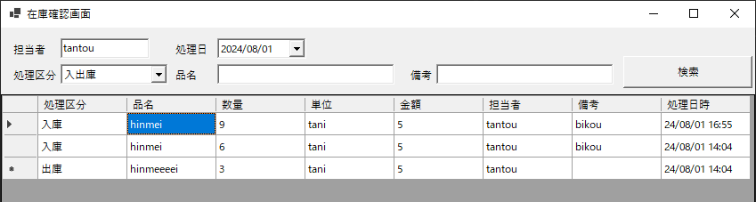

# インターンシップ課題  

## 入力画面の課題  
### 1. 入力をチェックする
単位が入力されていない、あるいは数量がゼロである状態の時でもデータを追加できてしまいます。  
入力された内容をチェックして、入力の問題を警告しましょう。  
下記のようなメッセージが表示されるようにしてください。  
  
> [!NOTE]
> - 追加ボタンを押すと何が起こるのか見てみる
>   - イベントについて
> - 他の項目の入力チェックの内容を見てみる
> - 単位の入力チェックを追加する
> - 数量の入力チェックを追加する
> - 警告のメッセージを表示する

### 2. 登録忘れの防止
この画面は追加ボタンを押した後で登録ボタンを押さなければ、データベースへ書き込みがされません。  
これは複数のデータを登録する前に間違いが無いかデータを確認してほしいためです。  
しかしうっかり登録ボタンを押し忘れて画面を閉じてしまうと入力したデータが書き込みされません。  
これを防ぐための機能を追加しましょう。  

> [!NOTE]
> - 終了ボタンを押すと何が起こるのか見てみる
> - 『登録状態』を持つ  
> - 追加ボタンが押されたら、『登録状態』を未登録にする  
> - 登録ボタンが押されたら、『登録状態』を登録済みにする  
> - 押し忘れて画面を閉じようとしたら止める  
> - 登録ボタンが押されていないことに気付くようにする  
>   - 登録ボタンの色を変えて未登録状態が目で見て分かるようにしたりする  
>   
>   

### 3. データ表示の改善
データグリッドビュー（画面下半分の表）へ表示される内容は、データテーブルの内容を直接参照して表示しています。  
確認画面を参考に、タイトルが付いて、処理区分の名前が表示されるように変更してみましょう。  
- 在庫入力画面と在庫確認画面のデータグリッドビュー  
  列名が日本語になっている、IDが表示されない、処理区分が日本語になっている等、同じデータを表示しても見た目が違うことがわかる。  
   - 在庫入力画面  
  
   - 在庫確認画面  
  

> [!NOTE]
> - 確認画面がどうやってデータを表示しているのか見る  
> - データグリッドビューに列名を設定する  
> - 列インデックスを定数として定義する  
> - 各セル／マスへデータをセットする  

### 4. データ表示の改善２   
在庫データの表示についてデータベースへ登録済みの分は、最新の20件のみ表示してほしいとユーザーから要望されました。  
これを実現してみましょう  

> [!NOTE]
> - 最新の20件とは何か考える  
> - データを新しい順に並べ替える  
>   - LINQの『[order by](https://learn.microsoft.com/ja-jp/dotnet/visual-basic/language-reference/queries/order-by-clause)』を使ってみる
> - 新しい順に20件取得する  
>   - [TakeLast](https://learn.microsoft.com/ja-jp/dotnet/api/system.linq.enumerable.takelast?view=net-8.0)という便利なメソッドがある  

## 確認画面の課題  
### 1. 検索結果をチェックする  
検索結果が０件だった場合にエラーが出てアプリが強制終了してしまいます。  
検索結果をチェックするプログラムを追加して、エラーが出ないようにしましょう。  
また検索結果が０件だった場合に下記のようなメッセージが表示されるようにしましょう。  
  

> [!NOTE]
> - 検索ボタンを押すと何が起こるのか見てみる  
> - 検索結果の件数によって処理を分ける  
> - メッセージを表示する  
>   - メッセージボックスにはタイトル、キャプション、本文、アイコン等が設定できる  
>   - 入力画面のValidateData()メソッドにあるメッセージボックスが参考になる  

### 2. 検索条件を追加する  
品名と備考の入力が検索結果に反映されていません。  
検索結果に反映されるようにしましょう。  

> [!NOTE]
> - 品名と備考を入力しても、検索結果に反映されていないことを確認する  
> - 検索条件を絞り込んでいる部分を見つける  
> - 担当者を検索条件にしている部分を参考に、検索条件を追加する  
>   - 段階を踏んでやってみましょう  
>     1. 担当者を絞り込んでいる部分を下の行へコピー＆ペースト  
>     2. カラム名TantousyaをHinmei/Bikouに書き換える  
>       ([テーブルレイアウト](./在庫管理アプリの概要.md#テーブルレイアウト)の列名をチェック)  
>     3. 検索条件になっているコントロール名txtTantouをtxtHinmei/txtBikouに書き換える  

画面と画面に配置された物には名前があり、これを『コントロール名』と呼んだりする。  
担当者、品名、備考の入力欄にはそれぞれ下図の様な名前がついている。  
  

### 3. 検索条件を完全一致から部分一致にする  
担当者、品名、備考の検索条件が完全一致となっています。  
検索条件を部分一致へ変更して入力した文字を含む場合に検索結果に表示されるようにしましょう。  
> [!NOTE]
> - 完全一致、部分一致とは？  
>   - 文字列Aと文字列B同士で先頭から最後の文字まで全て同じであるのが完全一致  
>     (例：abcde と abcde)  
>   - 文字列Aの中に、文字列Bが全文含まれていれば部分一致  
>     (例：abcdefg と cdefg)  
> - 担当者、品名、備考をそれぞれ部分一致で比較するよう検索条件を変更する  
>   - [String.Contains](https://learn.microsoft.com/ja-jp/dotnet/api/system.string.contains?view=net-8.0#system-string-contains(system-string))メソッドを利用することで、部分一致判定が出来る  

### 4. 検索結果を並べ替える  
データグリッドビューへ表示されるデータの順番は少し適当な順番になっています。  
処理日時とIDの昇順に表示されるようにしましょう。  

> [!NOTE]
> - 昇順というのは、小さい順のこと  
> - 入力画面の課題『[4. データ表示の改善２](./インターンシップ課題.md#4-データ表示の改善２)』でやった内容を思い出してみる  
> - 処理日時、昇順の両方を並べ替えの条件に設定する  
>   - odrder byはカンマ（,）で区切って複数の項目を設定できる  

例えば、処理日時昇順、ID昇順で並べ替えた場合に下の様になります。  
日の終わりに新しい入出庫から順番に入力していった場合の例です。  
IDは登録の度に1ずつカウントアップしますが、処理日時を優先して並べ替えるためこのようになります。  
| ID | 処理日時 |  
|-|-|   
| 12 | 2024-08-01 15:10:00 |  
| 10 | 2024-08-01 16:12:00 |  
| 11 | 2024-08-01 16:12:00 |  
| 14 | 2024-08-02 09:08:00 |  
| 13 | 2024-08-02 09:10:00 |  
| 17 | 2024-08-05 17:10:00 |  
| 16 | 2024-08-05 17:20:00 |  
| 15 | 2024-08-05 17:30:00 |  
| 18 | 2024-08-06 09:20:00 |  
| 19 | 2024-08-07 10:40:00 |  
| 20 | 2024-08-08 09:30:00 |  

### 5. 入出庫の両方を表示する  
この画面は処理区分の内、入庫または出庫のどちらかを選んで表示しています。  
入出庫の両方を一度に表示する方法を追加しましょう。  
   

> [!NOTE]
> - [テーブルレイアウト](./在庫管理アプリの概要.md#テーブルレイアウト)から処理区分に登録される内容を確認する  
>   - 入庫の場合は何が？出庫の場合は何が登録されるのか？  
> - 確認画面で処理区分を検索条件にしている部分を確認する  
>   - 何と何で比較・判定しているのか  
>   - 画面で選択した項目は、どんな形で比較の対象になっているのか  
> - コンボボックスの選択候補に『入出庫』を追加する  
> - 処理区分の判定条件を、入出庫が選ばれた場合を考慮したものに変更する  
>   - 入庫が選ばれている場合は、処理区分が1であることが条件になる  
>   - 出庫が選ばれている場合は、処理区分が2であることが条件になる  
>   - 入出庫が選ばれている場合は、処理区分が1か2であることが条件になる  

### 6. 処理時点での在庫数を表示する  
この画面は入出庫の履歴のみを表示しており、処理日時点の在庫数を見ることができません。  
データグリッドビューに列を追加してその時点の在庫数が見えるようにしましょう。  

#### 在庫を集計する条件  
- 品名毎の在庫を集計する  
- その行に書かれた処理直後の在庫数を表示する  
- 表示されていない部分も含めて全期間を集計対象とする  
- 期間の最初は全品の数量が0であるとする

> [!NOTE]
> - 処理時点での在庫数を表示する列をデータグリッドビューへ追加する  
> - 品名毎に在庫数を集計する仕組みを追加する  
>   - [Dictionary](https://learn.microsoft.com/ja-jp/dotnet/api/system.collections.generic.dictionary-2?view=net-8.0)クラスを利用  
>     - 品名に対する数量の形で利用するため、文字列をTKeyとして、数値をTValueとする
>       ```Visual Basic .NET
>       Dim wHinmeiAggregator As New Dictionary(Of String, Integer)
>       ```
>     - 品名に対応した数量のデータが記録されているか判定する  
>       ```Visual Basic .NET
>       If (wHinmeiAggregator.ContainsKey(ここに品名)) Then
>       ```
>     - 品名に対応した数量に、入出庫した数量を足す／引く
>       ```Visual Basic .NET
>       wHinmeiAggregator(ここに品名) += 入庫数または(-)出庫数
>       ```
>     - 品名に対応した数量がなければ、入出庫した数量を初期値としてデータを追加する
>       ```Visual Basic .NET
>       wHinmeiAggregator.Add(ここに品名, 入庫数または(-)出庫数)
>       ```
>     - 入出庫した時点の数量を表示する
>       ```Visual Basic .NET
>       Me.dgvInventory.Item(列, 行).Value = wHinmeiAggregator(ここに品名)
>       ```
>   - 検索結果の対象ではないデータも含めて集計する必要がある
>     - データ全体を全期間の最初から順番にアクセスしながら集計する必要がある
>     - アクセスしているデータに、検索対象のデータがあった場合にだけデータを表示する
>       - アクセスしているデータと、検索対象のデータを一意に対応させる必要がある
>       - [テーブルレイアウト](./在庫管理アプリの概要.md#テーブルレイアウト)にデータを一意に特定する方法が書いてある
