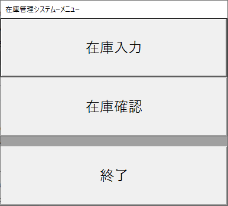
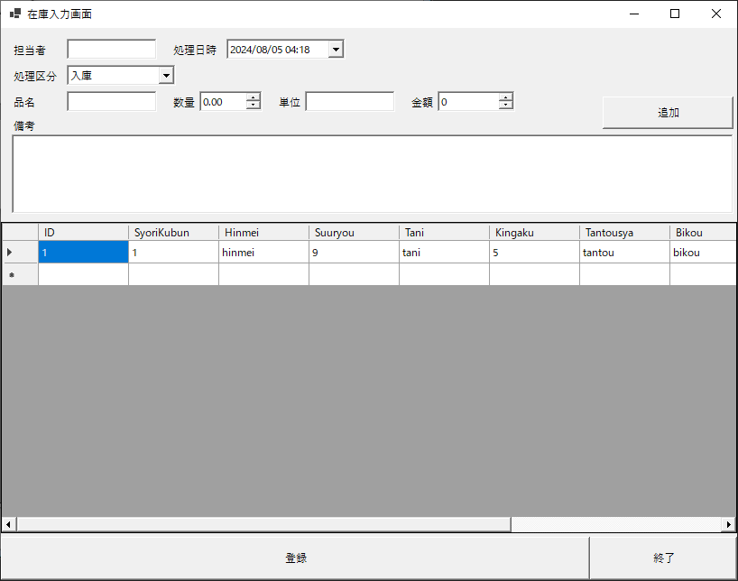
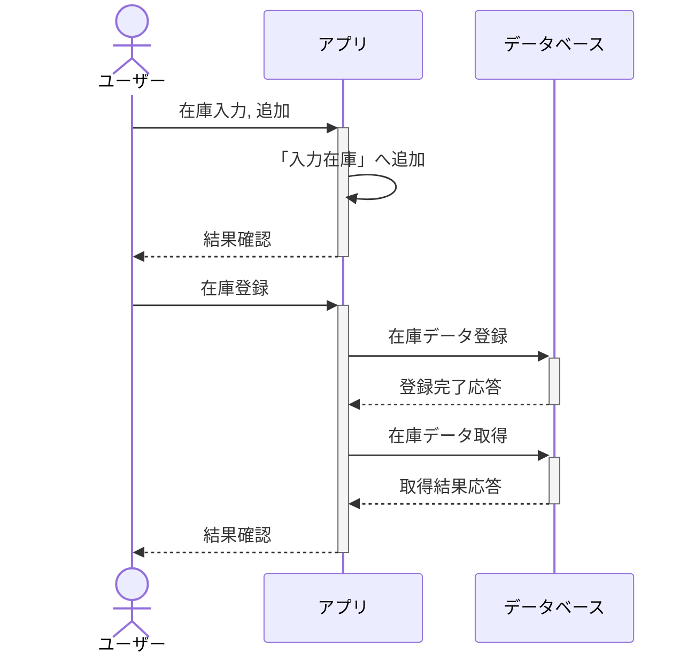
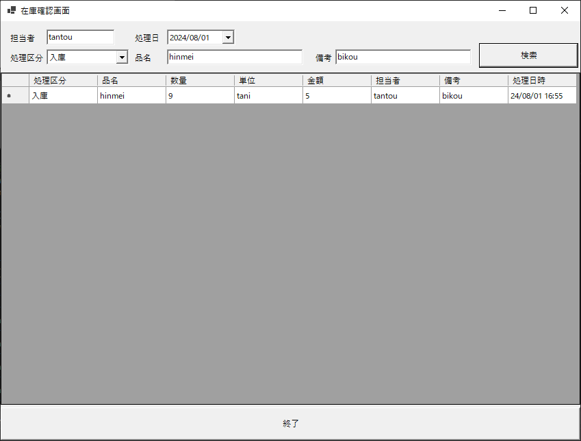
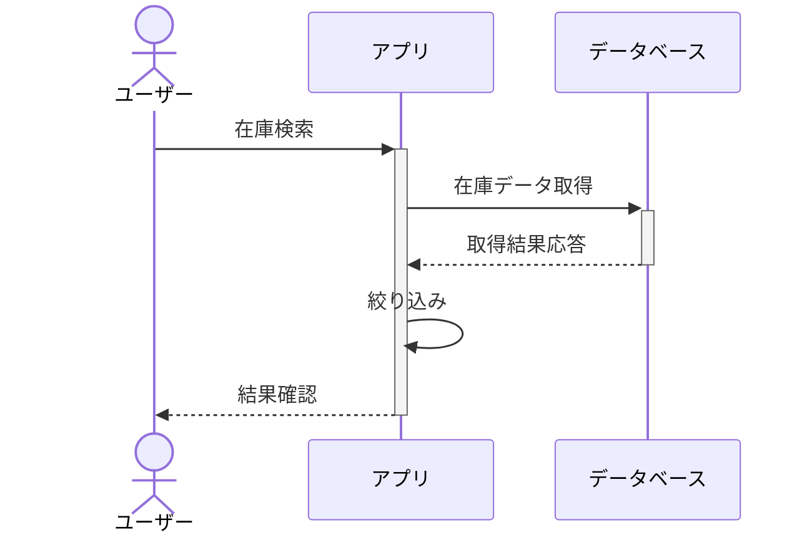

# 在庫管理アプリの概要  
このアプリは在庫の入出庫履歴をデータベースへ入力し、その確認をおこなうアプリケーションです。

## テーブルレイアウト
このアプリがアクセスするデータベースは、一つのテーブルだけで作られたデータベースになります。  
excelやgoogleスプレッドシートのような物をイメージしてもらうと分かりやすいと思います。

テーブル名：**InventoryLog**
| 列名          | 型       | 制約                       | 備考 |
|-----------------|-----------------|-----------------------------------|----|
| ID              | int             | IDENTITY(1,1) NOT NULL, PRIMARY KEY | データ一件を一意に特定するID |
| SyoriKubun      | char(1)         | NOT NULL                          | 処理区分(1:入庫/2:出庫) |
| Hinmei          | varchar(255)    | NOT NULL                          | 品名 |
| Suuryou         | int             | NOT NULL                          | 数量 |
| Tani            | varchar(8)      | NOT NULL                          | 単位 |
| Kingaku         | int             | NOT NULL                          | 金額 |
| Tantousya       | varchar(255)    | NOT NULL                          | 担当者 |
| Bikou           | varchar(512)    | NOT NULL                          | 備考 |
| SyoriDateTime   | datetime        | NOT NULL                          | 処理日時 |
| InputDateTime   | datetime        | NOT NULL                          | 入力日時 |
| UpdateDateTime  | datetime        | NOT NULL                          | 更新日時 |

## 画面説明
### メニュー画面  
この画面がプログラムを実行したときに一番最初に画面に出てきます。  
各機能を選択して使うためのメニューになっています。  
  
- 在庫入力ボタン  
在庫入力ボタンをクリックすると『在庫入力画面』を表示します。  
在庫入力画面が表示されている間、メニュー画面を無効化しています。  

- 在庫確認ボタン  
在庫確認ボタンをクリックすると『在庫確認画面』を表示します。  
在庫確認画面が表示されている間、メニュー画面を無効化しています。  

- 終了ボタン  
終了ボタンをクリックするとメニュー画面自体を閉じて、このプログラムの実行を終了します。  

### 在庫入力画面  
この画面は見えない所に入力途中の在庫データ（以下『入力在庫』）を持っています。  
この『入力在庫』は画面の下半分に表示している表（データグリッドビュー）と結びついていて、それが見えています。

  
- 担当者～備考  
この画面で入力する各種項目です。

- 追加ボタン  
担当者～備考の各項目をチェックして、問題がある場合にメッセージボックスを表示します。  
問題が無ければ、担当～備考に入力されている項目を『入力在庫』へ追加します。  
問題がある場合は追加しません。  

- 登録ボタン  
『入力在庫』の内容をデータベースに送信して、入力した内容を登録します。  
このボタンが押されるまでこの画面で入力した内容がデータベースに反映されることはありません。  
『入力在庫』を登録した後、データベースにある在庫データを取り込みし直して以降これを『入力在庫』とします。  

- 終了ボタン
この画面を消して、在庫入力を終了します。

### 在庫確認画面  
この画面も見えない所に在庫データ（以下『確認在庫』）を持っています。  
この『確認在庫』をうまく成形して画面の下半分に表示している表（データグリッドビュー）に表示する内容を作っています。  

  
- 担当者～備考  
この画面に表示したい内容を絞り込むための条件を入力する場所です。  

- 検索ボタン  
このボタンを押すとデータベースから最新のデータを取り込み『確認在庫』を更新します。  
更新した『確認在庫』を入力された条件（担当者～備考）に従って絞り込んで、『表示データ』を作ります。  
『表示データ』の内容をデータグリッドビューの各マスに設定します。  
このとき、データグリッドビューに設定されている各列の内容に合わせて『表示データ』の内容をうまく成形しています。  

- 終了ボタン  
この画面を消して、在庫確認を終了します。  

